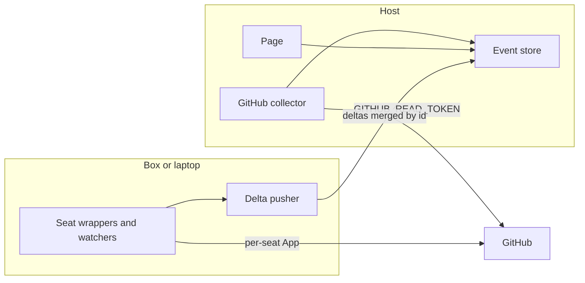

# Burst setup

Full install of the live board. A human can follow it top to bottom. A bot can follow the same steps: every command is generic, every id is a placeholder, and every secret stays in an environment variable.

Watcher behavior and the fixes log live in [PLAYBOOK.md](PLAYBOOK.md). Read that page when a step names a watcher. The fixes log is the reason several steps exist (hosted collector, token shape, paused VM, Checks).

Replace every `<placeholder>` before you run a command. Do not commit the filled-in file.

## 1. Overview

Two places run Burst.

- The **host** (for example Railway) runs the page and the GitHub collector. The collector writes straight into the server's event store.
- The **box or laptop** pushes local signals only: prompt lines, cloud-agent logs, and lab-run mtimes. Those arrive as deltas and are merged by id.

If the box is down, GitHub events still flow. Seat state that came from the box shows stale.

Each bot seat has its own GitHub App. The host does not hold any App private key. The host holds a fine-grained read-only personal access token, `GITHUB_READ_TOKEN`.



Files in this tree:

| Path | Role |
|---|---|
| [PLAYBOOK.md](PLAYBOOK.md) | Every watcher, active vs working, LIVE vs behind, fixes log |
| [activity.schema.json](activity.schema.json) | Line an agent submits |
| [prompts.schema.json](prompts.schema.json) | `prompts.jsonl` line |
| [cloud-agent.schema.json](cloud-agent.schema.json) | `cloud-agents.jsonl` line |
| [plate.schema.json](plate.schema.json) | Identity stamp |
| [seats.example.json](seats.example.json) | Sample seats config |
| `bin/` | `gh`, git credential helper, commit identity |
| `release.sh` | Atomic swap onto a pinned release |
| `house/live-mesh/fetch_feed.py` | Host collector |

## 2. GitHub Apps

Create **one GitHub App per seat**. Seats that write code or checks: builder, lab tester, infra/operator. The gate/critic app is narrower. The chief-of-staff app can file issues and pull-request reviews. The human architect does not get an App. Cloud agents do not hold a private key; the box records their lines.

Record, per App, in the seat's own environment (see [seats.example.json](seats.example.json)):

- App ID → `GITHUB_APP_ID`
- Installation ID → `GITHUB_APP_INSTALLATION_ID`
- Bot login → `BURST_BOT_LOGIN` (`<app-slug>[bot]`)
- Bot user id → `BURST_BOT_ID` (the account's `databaseId`)

Store the private key as an env secret, `GITHUB_APP_PRIVATE_KEY_PATH`, pointing at a file outside the repo, mode `0600`. The key never goes in git and never goes on the host.

### Write seat manifest

Builder, lab tester, and infra/operator. In GitHub: Settings → Developer settings → GitHub Apps → New. Or register with a manifest POST. Permissions:

```json
{
  "name": "<org>-burst-<seat>",
  "url": "https://<your-domain>",
  "public": false,
  "default_permissions": {
    "contents": "write",
    "pull_requests": "write",
    "issues": "write",
    "statuses": "write",
    "workflows": "write",
    "actions": "write",
    "checks": "read",
    "metadata": "read"
  },
  "default_events": ["push", "pull_request", "issues", "issue_comment", "workflow_run", "status"]
}
```

### Gate / critic manifest

`pull_requests`, `issues`, and `statuses` are write. `contents` is read. `checks` and `metadata` are read so the seat can see CI. GitHub includes metadata on every App.

```json
{
  "name": "<org>-burst-gate",
  "url": "https://<your-domain>",
  "public": false,
  "default_permissions": {
    "pull_requests": "write",
    "issues": "write",
    "statuses": "write",
    "contents": "read",
    "checks": "read",
    "metadata": "read"
  },
  "default_events": ["pull_request", "pull_request_review", "issues", "issue_comment", "status"]
}
```

### Install

1. Install the App on **your org**.
2. Repository access: only the watched repos.
3. Copy the App ID from the App settings page.
4. Open the installation URL. The number in `/installations/<INSTALLATION_ID>` is `GITHUB_APP_INSTALLATION_ID`.
5. Generate a private key. Save it outside the repo. `chmod 600` that file.
6. Set `GITHUB_APP_PERMISSIONS` to the same JSON object as `default_permissions` (no name, no url).

### How a token is minted

`house/burst/mint-cli.mjs` does this. `bin/gh` and `bin/git-credential` call it.

1. Build an RS256 JWT. `iss` is the App ID. Sign with the private key via `openssl dgst -sha256 -sign`. The JWT lives about 9 minutes.
2. `POST https://api.github.com/app/installations/<INSTALLATION_ID>/access_tokens` with that JWT and the permissions object.
3. If GitHub returns a permission that was not requested at that level, discard the token.
4. Accept the installation token only when it matches `^ghs_[A-Za-z0-9._-]{20,1024}$`. Real tokens are long and contain `.` and `_`.
5. Cache it at `$BURST_STATE/installation-token.json` (default `~/.burst/`), mode `0600`. Reuse it until 120 seconds before `expires_at`.

`node house/burst/mint-cli.mjs --plan` prints the URL and the permissions. It does not mint and it does not print a token.

## 3. Tokens

| Secret | Who holds it | Where it lives | Rotation |
|---|---|---|---|
| Per-seat App private key | That seat's box or laptop | `GITHUB_APP_PRIVATE_KEY_PATH` on that box. Mode `0600`. One key per App | Generate a new key on the App, point the env at the new file, delete the old file. The host never has this key: it can mint write tokens |
| `GITHUB_READ_TOKEN` | The host | Host variable only | Fine-grained PAT. Set an expiry. Rotate before it expires. Delete the old token after the host has the new one |
| `INGEST_SECRET` | Host and the box that pushes deltas | Same value in both environments. Sent as a header on the delta push, never in a URL or a log | Replace the host value and the box value together, then drop the old one |
| `MESH_PASSWORD` | Host only | Host variable. HMAC key for the page session cookie | Replace it on the host. Seat bots never see it |
| Installation token | The seat process, in memory and the cache file | `$BURST_STATE/installation-token.json`, mode `0600` | Minted for you. Cache expires 120 seconds before `expires_at` |

`POST /activity` does not take a static `ACTIVITY_KEY`. The seat sends its installation token. The host checks the bot login, the bot id, and the org.

### Fine-grained read token

GitHub: Settings → Developer settings → Personal access tokens → Fine-grained.

1. Resource owner: your org.
2. Repository access: only the watched repos.
3. Permissions, read-only: Contents, Pull requests, Issues, Actions, Commit statuses. Metadata is included automatically.

Fine-grained tokens have no Checks permission. The collector derives check state from Actions runs and jobs, and from commit statuses.

Set the token as the host variable `GITHUB_READ_TOKEN`. Keep it out of the repo, out of logs, and off the laptop. Set an expiry and rotate it.

## 4. Railway deploy

The page and the collector run as one project on the host. The collector is `house/live-mesh/fetch_feed.py`. It writes the event store the page reads.

### Create the project

CLI:

```bash
railway login
railway init --name burst-live
```

Repo-connected: in the dashboard, New Project → Deploy from GitHub repo → select this repo and the branch you ship. Or `railway add --repo <org>/<repo>`. Root directory stays the repo root.

### Variables

Set these on the service. Dashboard → service → Variables, or:

```bash
printf '%s' '<fine-grained-pat>' | railway variable set GITHUB_READ_TOKEN --stdin
printf '%s' '<long-random>' | railway variable set INGEST_SECRET --stdin
printf '%s' '<long-random>' | railway variable set MESH_PASSWORD --stdin
railway variable set BURST_REPOS='<org>/<repo>'
railway variable set BURST_HEALTH_URL='https://<your-domain>/health'
```

`--stdin` keeps the secret out of the shell history. `railway variable set` also accepts `KEY=value` when the value is not secret.

Do not set `GITHUB_APP_ID`, `GITHUB_APP_INSTALLATION_ID`, or `GITHUB_APP_PRIVATE_KEY_PATH` on this service.

### Start command

```bash
python3 house/live-mesh/fetch_feed.py --watch 60 \
  --out /data/live-events.json \
  --health "$BURST_HEALTH_URL"
```

Mount a volume at `/data` so the event store survives a restart. Serve `docs-site/static/live` as the page, from that same store (`live-events.json` beside `index.html`).

Health check path: `/health`. The collector's `probe` records the status code and does not read the body.

### Deploy

CLI, from a clean checkout:

```bash
railway up
railway logs
```

Repo-connected: push the branch. Railway builds that commit. Confirm the log line `host GITHUB_READ_TOKEN: read-only; GitHub App private key is not loaded`. The token value is not in that line.

### Custom domain

Optional. Service → Settings → Networking → Custom Domain. Add the CNAME Railway shows to `<your-domain>`.

### Config as code is deprecated

`railway.json` and `railway.toml` (Config as Code) are deprecated. Existing files are still read for services that already use them. They stop being read on **2026-12-01**. New services cannot opt into Config as Code.

Migrate before that date:

```bash
railway config migrate
railway config plan
railway config apply
```

Infrastructure as Code lives in `.railway/railway.ts` (Python and Go authoring are the other options). Keep secrets in Railway variables. A plan that still sees `railway.json` or `railway.toml` is blocked until that file is gone, so the two systems are not both in charge.

## 5. Box or laptop pusher

The box pushes local deltas. It does not poll GitHub for the board.

### Install

Pin a release tag. A floating branch tip is not a pin.

```bash
git clone --branch <release-tag> --depth 1 <repo-url> "$HOME/burst-releases/<release-tag>"
```

Needs `node`, `python3`, and `flock`. Copy `seats.example.json` to `$BURST_STATE/seats.json` (`BURST_STATE` defaults to `~/.burst`) and fill the placeholders there, outside the repo.

### First link

Point `current` at the pin. Leave `BURST_OLD_STOP` unset on the first link so nothing is stopped.

```bash
export BURST_STATE="$HOME/.burst"
unset BURST_OLD_STOP
house/burst/release.sh "$HOME/burst-releases/<release-tag>"
```

### Supervisor and watchdog

`house/burst/supervise.py` is the restart rule: start the command, and start it again when it exits, until the stop file exists. The box watchdog is that loop with 60 seconds between starts. `push.sh` posts one delta while it holds the lock on fd 9, then sleeps with `9>&-`.

```bash
export BURST_STATE="$HOME/.burst"
PIN="$BURST_STATE/current/house/burst"
STOP="$BURST_STATE/stop"
rm -f "$STOP"
while [ ! -f "$STOP" ]; do
  export BURST_TOKEN_MINTED=$(date +%s)
  sh "$PIN/push.sh" || true
  sleep 60
done
```

Create `$BURST_STATE/stop` to end the loop. `remint_due` compares wall-clock stamps (`BURST_TOKEN_MINTED` from `date +%s`). A 401 exits 75 and does not write. See fixes 4 and 9 in [PLAYBOOK.md](PLAYBOOK.md).

### Zero-gap swap

`release.sh` replaces `$BURST_STATE/current` with one `mv -T`, so the path is never missing. The running loop keeps the code it already loaded. Start the new loop, then stop the old one.

```bash
export BURST_STATE="$HOME/.burst"
unset BURST_OLD_STOP
house/burst/release.sh "$HOME/burst-releases/<new-tag>"
```

Start the supervisor loop from the new `current` in a second session. When that loop is running, stop the old one:

```bash
: > "$BURST_STATE/stop"
```

To have `release.sh` create the old stop file, set `BURST_OLD_STOP` to the old loop's stop path. The script creates it after the link exists. Point the new loop at a different stop path, or it exits on the same file.

## 6. Seat setup

Every bot, and the builder that runs on a laptop (the off-box seat), uses **this** App's wrappers. A system or Homebrew `gh` on `PATH` ahead of `house/burst/bin` will talk to GitHub as the wrong identity.

```bash
export PATH="<repo>/house/burst/bin:$PATH"
export GITHUB_APP_ID=<APP_ID>
export GITHUB_APP_INSTALLATION_ID=<INSTALLATION_ID>
export GITHUB_APP_PRIVATE_KEY_PATH=<path-outside-the-repo>
export GITHUB_APP_PERMISSIONS='<permissions-json-for-this-seat>'
export BURST_BOT_LOGIN='<app-slug>[bot]'
export BURST_BOT_ID=<bot-database-id>
export BURST_SEAT_ID=<seat>
hash -r
command -v gh
```

`command -v gh` must print `.../house/burst/bin/gh`.

In the seat's clone:

```bash
use-repo
git push origin HEAD:<branch>
```

`use-repo` sets `user.name` to `BURST_BOT_LOGIN` and `user.email` to `<BURST_BOT_ID>+<BURST_BOT_LOGIN>@users.noreply.github.com`. The credential helper is `bin/git-credential`. It returns a fresh installation token. Author commits as the bot. A human name on a bot commit is the wrong stamp.

`bin/gh` forces the read-only plan when it is the wrapper that mints for API reads: a non-read permission exits 2. A write seat that must open a pull request exports `BURST_APP_READ_ONLY=0` and the write permission map from section 2 for that mint. The wrapper still refuses permission drift.

Verify the installation sees only your org's repos:

```bash
gh api /installation/repositories --jq '.repositories[].full_name'
```

Every `owner.login` is `<org>`. An empty list, or another org, means the wrong installation.

Forks: the App can push to the org's fork. Opening or merging on an upstream org needs an admin of that org.

Details of the laptop seat are also in [GITHUB-APP.md](GITHUB-APP.md) and in [PLAYBOOK.md](PLAYBOOK.md) under "Seat on a laptop".

## 7. Watchers on a builder seat

Install these on the builder laptop. They are local. They are not the host collector.

### Repo watcher

Every 30 seconds, poll the seat's repos and write a heartbeat (a timestamp). The loop records ids and times. It does not record command lines, environment, file names, or file contents.

```bash
while true; do
  gh api /installation/repositories --jq '.repositories | length' >/dev/null
  date +%s > "$BURST_STATE/heartbeat"
  sleep 30
done
```

### Activity

House rule: every seat logs background work. Append one line to `fleet/activity.jsonl` when the work starts, and one line when it ends. `POST /activity` takes that same object and an installation token. There is no static key.

`seat` is optional on the post. When the body includes it, it must match the token's seat, case-insensitive. Any other seat is **403** `seat mismatch`. The stored line's `seat` is the token's seat.

The line is `t_ct` (ISO-8601 with a numeric offset), `kind` (`subagent`, `turn`, or `watcher`), `action` (`start` or `end`), and `tag` (at most 80 characters), plus `seat` on the file. Names and times only. A seat is working while a start has no later end for the same seat, kind, and tag, for at most 60 minutes. A `SENT` line in `prompts.jsonl` also keeps that seat working for 10 minutes. Display names resolve through `aliases` in the seats config (`Chief of Staff` → `CoS`, `Lab Tester: Chaos` → `Chaos`). The feed lists `fleet.missing_activity`: seats pulsed in the last 60 minutes with no activity line in that window. The page does not read that list. The light is not in N of M. The shape is [activity.schema.json](activity.schema.json).

Off-box seats POST with their own App token. One post at start, one at end. The window stays open until `end`. Do not post on a 30-second tick.

```bash
curl -sS -o /dev/null -w '%{http_code}\n' \
  -H "Authorization: Bearer $(node house/burst/mint-cli.mjs)" \
  -H 'Content-Type: application/json' \
  --data '{"t_ct":"2026-10-09T09:00:00-05:00","seat":"<seat>","kind":"turn","action":"start","tag":"issue-1"}' \
  https://<your-domain>/activity
```

A 204 means the line was stored. The response has no event list.

### What not to log

Leave these out of `prompts.jsonl`, `cloud-agents.jsonl`, the activity body, and the working store:

- prompt bodies, review bodies, commit messages
- command lines and environment
- file names and file contents
- tokens, private keys, `INGEST_SECRET`, `MESH_PASSWORD`

A line that contains `body`, `text`, or `message` as a field or a value is refused.

## 8. Activity schema

The contract is [activity.schema.json](activity.schema.json). [prompts.schema.json](prompts.schema.json) and [cloud-agent.schema.json](cloud-agent.schema.json) are the JSONL subsets.

| Field | Rule |
|---|---|
| `t_ct` | ISO-8601 with a numeric offset, such as `2026-10-09T09:00:00-05:00` |
| `seat` | Plate seat name. Must match the installation token's seat |
| `kind` | `prompt`, `turn`, `subagent`, `watcher`, `cloud_agent`, `lab_run`, `review`, `retest`, `deploy` |
| `action` | From the table below |
| `to` | Optional. At most 40 characters. A seat name or other short id |
| `agent` | Required for `cloud_agent`. Short id |
| `tag` | Optional. At most 80 characters. An issue key, PR number, or other id |

No other fields. No free text.

| kind | action |
|---|---|
| `prompt` | `start`, `end`, `sent` |
| `turn` | `start`, `end` |
| `subagent` | `start`, `end` |
| `watcher` | `start`, `end` |
| `cloud_agent` | `launch`, `reply`, `finished`, `cancel` |
| `lab_run` | `start`, `end`, `pass`, `fail` |
| `review` | `start`, `end`, `pass`, `fail` |
| `retest` | `start`, `end`, `pass`, `fail` |
| `deploy` | `start`, `end`, `pass`, `fail`, `cancel` |

Examples, one per kind, are the `examples` array in `activity.schema.json`. Older stored lines may still use `received`, `sent`, or `tick`. New lines use the table.

`prompts.jsonl` is prompt lines. `cloud-agents.jsonl` is cloud-agent lines, each with `agent`. One JSON object per line.

### Prompt lines

`prompts.jsonl` lives at `fleet/prompts.jsonl` next to `fleet/activity.jsonl`. Set `BURST_PROMPTS` to move it. Write one line when a seat gets a prompt:

```json
{"t_ct":"2026-10-09T08:59:30-05:00","seat":"builder","kind":"prompt","action":"sent"}
```

`seat` is the seat that got the prompt: a seat id, or a display name that resolves through `aliases`. `kind` is `prompt`. `action` is `sent`. That pulse keeps the seat working for 10 minutes and counts for `fleet.missing_activity`. `start` and `end` lines with a `tag` are also valid, but only `sent` pulses. Never write the prompt text. The shape is [prompts.schema.json](prompts.schema.json).

Older houses wrote `{"t_ct":"…","from":"Blaze","to":"Operator"}`. The collector still reads that shape as a `sent` pulse for the `to` seat, so an old file keeps working. Write new lines in the format above. `POST /activity` takes only the new format.

## 9. Roles and the stamped plate

The plate is the identity stamp on every submission and every GitHub write: seat name, App bot login, role, color, emoji. The schema is [plate.schema.json](plate.schema.json). A filled sample is [seats.example.json](seats.example.json).

Active is counted in N of M: a GitHub event, an owned-file mtime, a prompt, or an activity line within 15 minutes. Working is a light under the icon (lab-run, GitHub check, open turn). Working is not counted. The header dot blinks in the plate color while the seat is working. The chip text stays `LIVE` or `IDLE`.

| Role | Plate (sample) | What it submits | Channel | Active | Working |
|---|---|---|---|---|---|
| Architect / human | `architect`, bot empty, `#F5F7FA`, ✏️ | prompts | JSONL on the box, or `POST /activity` from a human session | a prompt line within 15 min | no lab light |
| Builder | `builder`, `builder-app[bot]`, `#3DE0E8`, 🔨 | turns, prompts, repo watcher heartbeat, pushes, PRs | GitHub via the App; JSONL and `POST /activity` on the laptop | GitHub events and the turn line | open turn; lab mtimes if this seat has run folders |
| Gate / critic | `gate`, `gate-app[bot]`, `#F5C518`, ✶ | reviews | GitHub reviews automatically; `kind: review` on `POST /activity` | a review event within 15 min | a running or failing check is the author's light, not the gate's |
| Lab tester | `lab`, `lab-app[bot]`, `#4A7FD4`, 🧪 | lab runs, retests | mtimes and CPU via `BURST_LABS`; `kind: lab_run` or `retest` | a GitHub event from this bot | file mtime in 150s or ≥1s CPU, held 120s. One time per seat. Not in N of M |
| Infra / operator | `operator`, `operator-app[bot]`, `#7C5CBF`, 🛠️ | deploys, health | status file the collector maps; `kind: deploy` | a deploy packet within 15 min | no extra light |
| Chief of staff | `coordinator`, `coordinator-app[bot]`, `#E07A3D`, 🖲️ | issues, routing lines | GitHub issues; `kind: turn` when a turn is open | a GitHub event or turn line | open turn |
| Cloud agents | `cloud`, `cloud-app[bot]`, `#3DDC97`, ☁️ | launch, reply, finished, cancel | `cloud-agents.jsonl` on the box | a line within 15 min | the turn window from `launch` until `finished` or `cancel` |

On a GitHub commit, the author is the bot login in the plate (`user.name` / noreply email from section 6). On an activity line, `seat` is the plate's `seat`. The color and emoji are how the page draws that seat. They are not extra fields on the activity line.

## 10. Verification and troubleshooting

Work top to bottom. Stop at the first failure.

- [ ] `command -v gh` is `house/burst/bin/gh`.
- [ ] `gh api /installation/repositories` lists only `<org>/<repo>` repos.
- [ ] `git config user.name` is `<app-slug>[bot]`.
- [ ] A turn `POST /activity` returns 204, and the stored line's seat matches the token.
- [ ] An 81-character `tag`, or a field named `message`, returns 400.
- [ ] The host log says the read-only token is in use and does not print the token.
- [ ] The host environment has no App private key.
- [ ] `generated_at` age ≤ 90s: the pill says **LIVE**. Older: **behind N min**. See [PLAYBOOK.md](PLAYBOOK.md).
- [ ] Stop the box. GitHub events still arrive. Box-sourced seats show stale.
- [ ] `$BURST_STATE/current` is a symlink to the pinned release, and `current.next` is gone after `release.sh`.

| Symptom | What to check |
|---|---|
| Board goes stale when the laptop sleeps | The GitHub collector is still on the laptop. Move it to the host with `GITHUB_READ_TOKEN`. Fixes log item 10 |
| Pill says behind N min | `generated_at` is older than 90s. The host collector is paused, or the page is reading an old file |
| HTTP 401 and the feed was not rewritten | `AuthExpired`. Exit 75. Remint from the wall clock. Fixes log item 4 |
| 401 before GitHub is asked | Token shape. The accepted form is `^ghs_[A-Za-z0-9._-]{20,1024}$`. A token with `.` or `_`, or longer than 255, used to be rejected locally. Fixes log item 8 |
| Paused VM kept a dead token | `BURST_TOKEN_MINTED` must be `date +%s`. A frozen counter misses the jump. Fixes log item 4 |
| Checks never light | The fine-grained host token has no Checks permission. Confirm Actions and Commit statuses are read. The collector reads Actions runs, jobs, and commit statuses. Fixes log item 2 |
| Delta push returns 409 | `base` is not the current `epoch.seq`. Refetch the full feed and continue. Fixes log item 5 |
| `?since` returns 304 | The client is already at the current seq. Keep the page as it is |
| Pusher will not start | An old `sleep` held the lock. `push.sh` closes fd 9 before sleep. Fixes log item 9 |
| Commits show a human name | `use-repo` did not run, or `bin/` is after another `gh` on `PATH` |
| Activity 401 `not a seat installation` | Bot login or bot id in the seats config does not match the token's viewer |
| Activity 403 `seat mismatch` | The body's `seat` does not match the token's seat. Drop `seat` or send the token's seat. A static key is not accepted |
| A seat that just sent a prompt looks idle | `fleet/prompts.jsonl` (or `BURST_PROMPTS`) needs `action` `sent` (or a legacy `{from,to}` line) and a seat the aliases table knows. The light lasts 10 minutes. Fixes log item 13 |
| `fleet.missing_activity` names a seat | That seat pulsed in the last 60 minutes and wrote no `activity.jsonl` line in that window |

The fixes log in [PLAYBOOK.md](PLAYBOOK.md) is the history of those rows. When a row and the log disagree, the log's current rule is the one the code implements.
